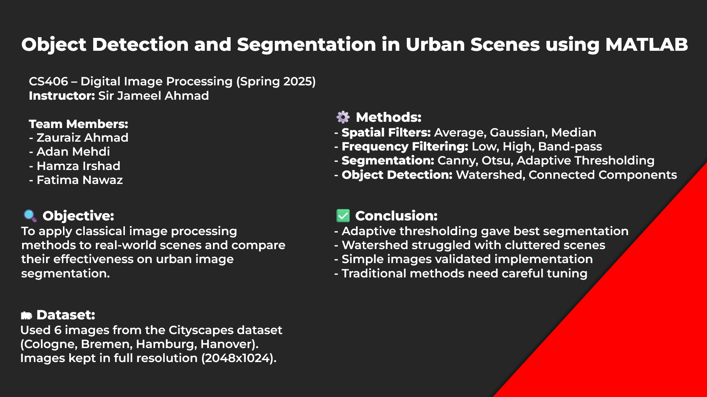

# Object Detection and Segmentation in Urban Scenes (CS406)

This project explores classical image processing techniques using MATLAB on the Cityscapes dataset for object segmentation.

## 🔧 Folder Structure
- `code/` – MATLAB scripts
- `data/` – Dataset instructions
- `results/` – Output images
- `poster/` – Final presentation poster
- `report/` – Final PDF report

## 👥 Team Members
- Muhammad Zauraiz Ahmad – F2023266573
- Syed Muhammad Adan Mehdi – F2023266584
- Hamza Irshad - F2023266483
- Fatima Nawaz - F2023266486

## 📂 Dataset
We used the Cityscapes dataset. Instructions to download: [https://www.cityscapes-dataset.com](https://www.cityscapes-dataset.com)

## 🖼 Poster Preview

## 📄 LaTeX Report on Overleaf

You can view the LaTeX source and final report here:  
🔗 [Overleaf Report Link](https://www.overleaf.com/read/bnfdgfptgtgj#232bb5)

## 📜 License
This project is licensed under the MIT License.
